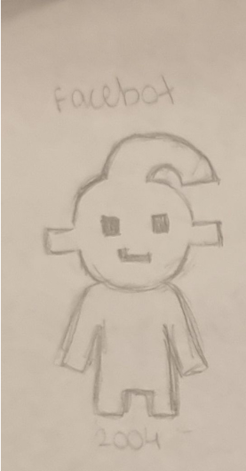
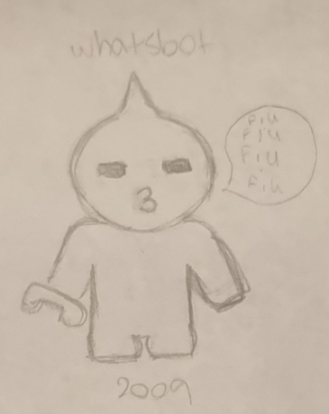
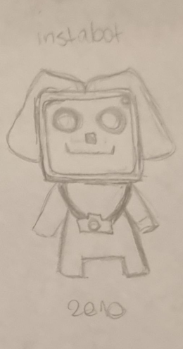
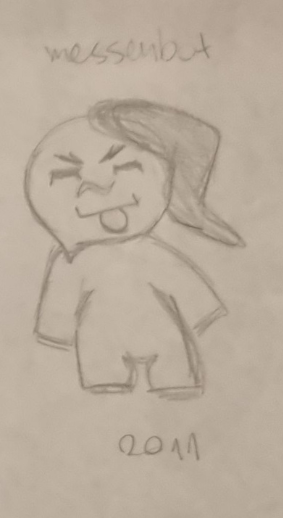
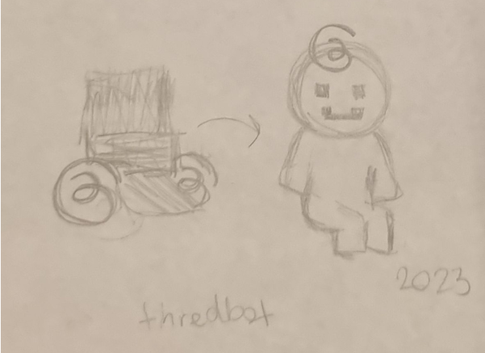
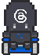
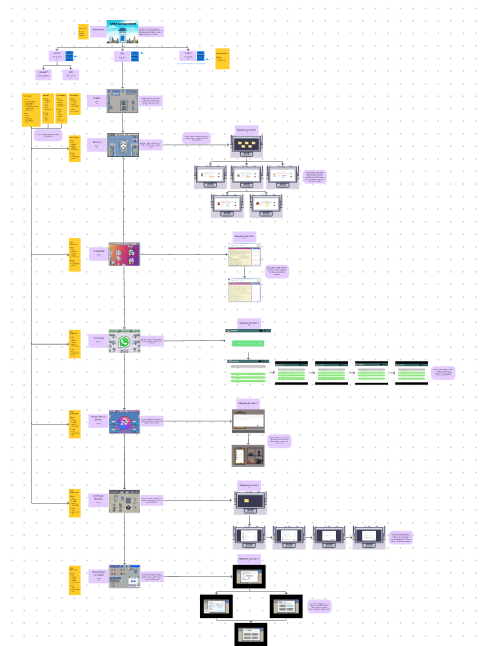

# GDD - Game Design Document - Módulo 1 - Inteli

## Meta Tower Game
## MetaMakers 

### Integrantes do grupo

#### <a href="https://www.linkedin.com/in/arthur-bretas-b2a6a82b9/">Arthur Bretas Oliveira</a>

#### <a href="https://www.linkedin.com/in/calebe-matias/">Calebe Yan Veras Matias</a>

#### <a href="https://www.linkedin.com/in/daviversan/">Davi D'avila Versan</a>

#### <a href="https://www.linkedin.com/in/j%C3%BAlia-lika-ishikawa/">Júlia Lika Ishikawa</a>

#### <a href="https://www.linkedin.com/in/lucas-nunes-matheus/">Lucas Matheus Nunes</a>

#### <a href="https://www.linkedin.com/in/rafael-furtado-b30715265/">Rafael Furtado Victor dos Santos</a>

#### <a href="https://www.linkedin.com/in/sophia-emanuele-de-senne-silva/">Sophia Emanuele de Senne Silva</a>

## Sumário

[1. Introdução](#c1)

[2. Visão Geral do Jogo](#c2)

[3. Game Design](#c3)

[4. Desenvolvimento do jogo](#c4)

[5. Casos de Teste](#c5)

[6. Conclusões e trabalhos futuros](#c6)

[7. Referências](#c7)

[Anexos](#c8)

 

# 1. Introdução

## 1.1. Escopo do Projeto

### 1.1.1. Contexto da indústria

&nbsp;&nbsp;&nbsp;&nbsp;
No setor de tecnologia brasileiro, conforme [1], a Meta enfrenta concorrência acirrada de empresas como Google, Amazon e Microsoft. Com modelos de negócios baseados em publicidade, dados e serviços de tecnologia, a Meta está focada em tendências de realidade virtual, inteligência artificial e redes sociais. A competição se intensifica na busca por inovação, parcerias estratégicas e expansão de serviços digitais, refletindo uma dinâmica de mercado desafiadora e em constante evolução.  
&nbsp;&nbsp;&nbsp;&nbsp;As 5 Forças de Porter, segundo [2], representam uma metodologia de análise estratégica que contemplam os seguintes elementos:

1. Rivalidade entre concorrentes, que estuda a composição do mercado em que a empresa está inserida e suas relações com competidores;

2. Produtos substitutos, que analisa quais soluções de outras organizações podem vir a substituir as soluções e produtos oferecidos pela empresa em questão;

3. Poder de barganha dos fornecedores, que destaca a representatividade de diversos fornecedores e suas capacidades de negociação;

4. Ameaça de novos entrantes, que se relaciona com a possibilidade de empresas emergentes adentrarem o mercado com soluções inovadoras;

5. Poder de barganha dos compradores, que verifica o índice de negociação disponível aos consumidores das soluções e produtos da empresa analisada

&nbsp;&nbsp;&nbsp;&nbsp;Desse modo, é possível construir a análise aprofundada dos aspectos principais da empresa parceira, conforme a Figura 1 a seguir.

Figura 1 - As 5 forças de Porter.

Fonte: Material produzido pelos autores (2024).

### 1.1.2. Análise SWOT

&nbsp;&nbsp;&nbsp;&nbsp;A análise SWOT, conforme [3], (Strengths, Weaknesses, Opportunities, Threats) ou FOFA (Forças, Oportunidades, Fraquezas, Ameaças) é um template de verificação de desempenho de organizações que buscam compreender em detalhes as áreas de atuação de seu negócio. Os pontos fortes e fracos se relacionam com questões internas da empresa, enquanto as oportunidades e as ameaças estão ligadas a áreas externas, que estão fora do escopo de atuação da organização em análise. Nesse sentido, de acordo com [4], vale pontuar tal análise para a empresa parceira, a Meta, conforme a Figura 2 a seguir.

Figura 2 - Matriz SWOT
 
Fonte: Material produzido pelos autores1 (2024) 
 1Matriz produzida a partir de [5].  

 

&nbsp;&nbsp;&nbsp;&nbsp;Ademais, de forma complementar, a seguir está a análise SWOT descrita detalhadamente em texto: 

&nbsp;&nbsp;&nbsp;&nbsp;**Forças (Strengths)**

1. Marca Reconhecida e Líder de Mercado: A Meta é uma das empresas de redes sociais e tecnologia mais conhecidas e influentes do mundo.
2. Grande Base de Usuários: A plataforma da Meta, conta com o banco de dados do Facebook, Instagram, WhatsApp e Messenger, possui bilhões de usuários ativos mensais, proporcionando uma enorme base de informações que pode gerar oportunidades de monetização.
3. Inovação Tecnológica: A Meta investe em pesquisa e desenvolvimento regularmente, liderando inovações em realidade virtual, inteligência artificial e outras áreas tecnológicas emergentes.
4. Capacidade de Monetização: A empresa tem uma forte capacidade de gerar receita através de publicidade segmentada e outros serviços pagos, como assinaturas no instagram por exemplo.

&nbsp;&nbsp;&nbsp;&nbsp;**Fraquezas (Weaknesses)**

1.  Questões de Privacidade e Segurança: A Meta sofre críticas constantes relacionadas à privacidade dos usuários e ao uso de dados, o que pode vir a influenciar a confiança do público e usuários de suas plataformas. E posteriormente pode resultar em ações regulatórias governamentais.
2.  Dependência de Receita de Publicidade: Dentro da receita de 116,6$ bilhões cerca de 97,5% da receita da Meta vem da publicidade, esse fator a torna vulnerável a mudanças nas tendências de marketing digital e a concorrência de outras plataformas.
3.  Concorrência Acirrada: O setor de redes sociais é altamente competitivo, com a Meta enfrentando concorrência de empresas como Google, X e outras plataformas emergentes.
4.  Riscos de Reputação: A empresa está sujeita a riscos significativos de reputação devido a polêmicas, controvérsias e desinformação e uso indevido de suas plataformas por parte de usuários, como os exemplos de tráfico sexual, que ocasionou no banimento momentâneo do facebook do marketplace da apple no oriente médio.

&nbsp;&nbsp;&nbsp;&nbsp;__Oportunidades (Opportunities)__

1. Expansão para Novos Mercados: A Meta pode explorar oportunidades de crescimento em mercados emergentes e expandir sua presença globalmente.
2. Diversificação de Receita: Além da publicidade, a Meta pode diversificar suas fontes de receita através de serviços de assinatura, comércio eletrônico e produtos de realidade aumentada, que geram bilhões em receita para a empresa.
3. Inovação em Novas Tecnologias: A empresa pode continuar investindo em realidade virtual, realidade aumentada e outras tecnologias emergentes para expandir suas ofertas de produtos e serviços.
4. Parcerias Estratégicas: A Meta pode buscar parcerias estratégicas com outras empresas de tecnologia, mídia e ou entretenimento para criar novas oportunidades de crescimento e expandir seu alcance.

&nbsp;&nbsp;&nbsp;&nbsp;__Ameaças (Threats)__

1. Regulamentação Governamental: A Meta está sujeita a regulamentações midiáticas por parte dos governos em várias questões relacionadas à privacidade e proteção de dados dos usuários. Outro fator é a concorrência em outras questões, o que pode impactar negativamente suas operações.
2. Mudanças nas Preferências dos Usuários: As mudanças constantes nas preferências dos usuários em relação às redes sociais e ao consumo de mídia digital podem afetar a relevância e o uso das plataformas da Meta, que exigem uma constante mudança na forma de expor a mídia e seus conteúdos.
3. Desafios de Segurança Cibernética: A empresa enfrenta ameaças recorrentes, sofrendo ataques cibernéticos, vazamentos de dados e outras vulnerabilidades de segurança que podem prejudicar sua reputação e operações.
4. Instabilidade Econômica Global: Flutuações econômicas globais e incertezas geopolíticas podem afetar a demanda por publicidade digital e os investimentos em tecnologia, impactando diretamente a Meta.

&nbsp;&nbsp;&nbsp;&nbsp;__Competidores__

- Mídias Sociais e Mensagens:WeChat, Twitter(X), Pinterest e Snapchat
- Anúncios: Google e Amazon
- Ferramentas de Trabalho: Microsoft Teams, Slack e Zoom
- Vídeos: Youtube e Tik Tok
- Encontros Online: Tinder, Hinge e Bumble
- Pagamento eletrônico: Paypal, Apple e Venmo
- Marketplace P2P: Letgo, OfferUp, Craigslist e eBay

### 1.1.3. Descrição da Solução Desenvolvida

&nbsp;&nbsp;&nbsp;&nbsp;O jogo busca solucionar a necessidade de comunicar o processo de contratação de fornecedores aos colaboradores da Meta de forma lúdica e acessível, com ênfase à questão da diversidade. Como fonte, usou-se informações do instagram "@metaglobalsupplierdiversity", em [6], bem como de entrevistas com a Lead de Strategic Sourcing da Meta para América Latina, Patricia Gandolfi, como [7], da palestra da Manager do programa de Supplier Diversity da Meta, Thaís da Silva, além de documentos fornecidos pela própria Meta. O jogo instruirá os colaboradores acerca de cada etapa de contratação de fornecedores diversos. 
&nbsp;&nbsp;&nbsp;&nbsp;Inicialmente, a solução proposta poderá ser utilizada pelos colaboradores da Meta em seus computadores e celulares, de forma que eles possam aprender sobre o processo antes de realizarem a contratação de algum fornecedor, com praticidade e abordagem lúdica. Assim, os colaboradores irão compreender melhor o processo de contratação, ao terem um primeiro contato dinâmico com o processo e podendo testar os seu conhecimentos ao longo do jogo. 
&nbsp;&nbsp;&nbsp;&nbsp;Além disso, a linguagem do jogo - verbal e não-verbal - também é de mais fácil, conforme [8], entendimento que os textos de explicação da operação. Consequentemente, com a maior compreensão, haverá menos erros no processo de contratação. 
&nbsp;&nbsp;&nbsp;&nbsp;A proposta terá sucesso se os colaboradores compreenderem as etapas do processo de contratação, a importância da diversidade nele e a responsabilidade de quem contrata; assim, a medida utilizada para avaliá-lo será o aumento na quantidade de contratações efetuadas com sucesso, isto é, em que os fornecedores atendam aos requisitos apresentados, como diversidade, orçamento e respeitar a Lei Geral de Proteção de Dados Pessoais(LGPD).

### 1.1.4. Proposta de Valor

&nbsp;&nbsp;&nbsp;&nbsp;O Canvas da Proposta de Valor, assim como diz [9] e [10], é uma ferramenta de análise de negócio que pondera as necessidades do cliente e o valor oferecido pelo produto ou serviço ofertado. Nesse sentido, compreende-se mais claramente o perfil, as dores e os trabalhos do consumidor e apresenta-se a solução de maneira adequada, a partir de aliviadores e criadores de ganho para os clientes. Desse modo, o Canvas apresenta de forma visual, clara e direta quais são os benefícios do produto ou serviço ao cliente, ao considerar suas próprias necessidades e dificuldades, conforme Figura 3.

Figura 3 - Canvas da Proposta de Valor.
  
Fonte: Material produzido pelos autores1(2024).   
 1Canvas produzido a partir de um template do site Strategyzer.  
Disponível <a href="https://assets-global.website-files.com/64830736e7f43d491d70ef30/64bfe9c02096a9761ebe3ec0_Screenshot%202023-07-25%20at%2017.19.37.png">aqui</a>[11].

 
 
&nbsp;&nbsp;&nbsp;&nbsp;Ademais, de forma complementar, a seguir está a Proposta de Valor descrita detalhadamente em texto: 

__1. Perfil do Consumidor__

- __Jobs to be done__
  - Funcional: Instruir os colaboradores da Meta sobre o processo de contratação de fornecedores.
  - Social: Inteirar os colaboradores sobre um processo do qual todos os funcionários precisam conhecer.
  - Emocional: Tornar a experiência de aprendizagem do colaborador mais satisfatória.
- __Gains__

  - Processo de aprendizagem mais satisfatório para o colaborador.
  - A economia de tempo e a aprendizagem mais concreta tornariam a experiência do colaborador mais agradável.
  - Uma solução que torne mais eficiente o aprendizado dos colaboradores.
  - Solução traz segurança ao colaborador em executar a rotina.
  - Integrar o colaborador à cultura e às operações da empresa (maior conexão).
  - Uma curva de aprendizagem menor encanta os colaboradores; assim como, uma solução didática e lúdica.

- __Pains__
  - Esforço substancial e alto gasto de tempo do colaborador.
  - A documentação (solução atual) é extensa, complexa e entediante.
  - O processo de entendimento da rotina com fornecedores é frustrante para os colaboradores.
  - Colaborador se sente inseguro em executar a rotina e cometer erros.
  - Erros consequentes da incompreensão do processo causam problemas jurídicos, desperdício de recursos e maior demora de processos burocráticos.
  - Colaboradores não tem uma solução melhor à disposição.
     

__2. Mapa do Produto__

- __Produtos e serviços__

  - Um jogo interativo, dinâmico e didático que instrui sobre a rotina de contratação de fornecedores, sob a ótica de diversidade de fornecedores, de forma facilitada.

- **Criadores de ganho**

  - Facilita o trabalho/estudo do colaborador: Jogo possui ritmo mais acelerado e mais interatividade do que a documentação.
  - Torna o processo de aprendizado mais lúdico, assim, torna a experiência do colaborador mais satisfatória.
  - Acelera a aprendizagem e otimiza o tempo do colaborador.
  - A compreensão sólida através do game cria uma segurança maior no colaborador em executar o processo.
  - Inteira todos os colaboradores de forma prática, descomplicada e lúdica (gera maior conexão).

- **Analgésicos / Aliviam as dores**
  - Produz economia de tempo e de esforço dos colaboradores.
  - Elimina frustração do colaborador no antigo processo de aprendizagem.
  - Aumenta a eficiência das operações, pois a capacitação é mais rápida, mais sólida e mais satisfatória.
  - Facilita a compreensão da rotina com os fornecedores com ludicidade e didática, advindas da gamificação.
  - Minimiza erros operacionais futuros por falta de compreensão do processo.

&nbsp;&nbsp;&nbsp;&nbsp;Dessa forma, a partir desse diagnóstico do perfil do cliente e dos atributos do produtos, se compreende a forma como a solução proposta está diretamente relacionada às necessidades e aos desejos do parceiro, podendo oferecer um entregável o mais alinhado possível com suas expectativas.

### 1.1.5. Matriz de Riscos

&nbsp;&nbsp;&nbsp;&nbsp;A matriz de risco, segundo [12] e [13], é um modelo visual para análise de riscos no contexto de um projeto. Nesse sentido, avalia-se o impacto e a probabilidade de cada risco e, a partir desse ponto, busca-se formas de mitigar as maiores ameaças ao desenvolvimento do projeto. Paralelamente, as oportunidades também são mensuradas, com o objetivo de maximizar resultados circunstancialmente. Dessa forma, tal ferramenta permite à equipe tomar decisões mais eficazes e mais seguras ao projeto.

&nbsp;&nbsp;&nbsp;&nbsp;Ademais, percebe-se a relação direta de impacto e probabilidade de riscos relacionados ao projeto, conforme Figura 4 a seguir.
 

Figura 4 - Matriz de riscos.

Fonte: Material produzido pelos autores (2024). 
Template disponível <a href="https://miro.com/pt/modelos/matriz-de-risco/">aqui</a> [14].

&nbsp;&nbsp;&nbsp;&nbsp;Por fim, com uma visão mais aprofundada de negócios, nota-se também que a matriz de riscos é uma ferramenta viva, uma vez que regularmente, conforme o andamento do projeto, a matriz deve ser revisitada e analisada, a fim de monitorar os riscos descritos e novos, assim como, suas respectivas mudanças.
 

## 1.2. Requisitos do Projeto

&nbsp;&nbsp;&nbsp;&nbsp;Inicialmente, no kick-off com o parceiro, realizado no dia 01/01/2024, a Meta esclareceu os pontos fundamentais para o desenvolvimento do MVP. Conforme o Quadro 1 a seguir, estão dispostos os requisitos basilares, para a construção da solução proposta, de forma alinhada às expectativas da empresa parceira (vide Quadro 1). 

Quadro 1 - Requisitos do jogo.

| \#  | Requisito                                                                                                                                                                     |
| --- | ----------------------------------------------------------------------------------------------------------------------------------------------------------------------------- |
| 1   | O controle do personagem será realizado usando as setas do teclado                                                                                                            |
| 2   | A visão da câmera será 2D top-down                                                                                                                                          |
| 3   | O jogo deve possuir uma tela de menu com botões start, options e credits                                                                                                      |
| 4   | A arte do jogo será produzida em pixel art                                                                                                                                    |
| 5   | O gameplay será centrado na metodologia ágil elaborada pelo grupo (Ensinar - Avaliar - Classificar)                                                                           |
| 6   | O cenário será uma torre (Meta Tower) e seus ambientes internos                                                                                                               |
| 7   | Cada andar da torre será baseado em uma etapa do Supplier Journey                                                                                                             |
| 8   | Sempre que o usário acertar a maior parte de um questionário referente ao respectivo andar em que se encontra, ele poderá subir de andar                                      |
| 9   | Se o usuário não acertar o número mínimo de questões do questionário, ele permanecerá no mesmo andar e irá refazer o questionário com novas perguntas geradas aleatoriamente. |
|10 | Cada andar deve apresentar um minigame para instruir o usuário sobre a respectiva etapa do Supplier Journey |
|11 | Cada minigame deve se relacionar com a e referente etapa de contratação do fornecedor e conter elementos que correspondam ao andar no qual está inserido. |
|12 | O áudio do jogo deve se adaptar com as situações em que o jogador estiver. Por exemplo, durante as partes de leitura e assimilação de informações tocar uma música tranquila para que o usuário possa se concentrar.|
|13 | A tela do jogo deve ser reponsiva e se adaptar conforme o dispositivo utilizado |
|14 | As caixas de diálogo devem ser proporcionais à tela e conter o texto de forma uniforme e centralizada |
|15 | Os NPCs devem ser interativos e fornecer informações relevantes ao usuário sempre que houver uma interação |

Fonte: Material produzido pelos autores (2024).

&nbsp;&nbsp;&nbsp;&nbsp;Dessa forma, os requisitos acima indicados foram mantidos em vista durante todo o desenvolvimento do entregável, a fim de construir a solução mais adequada ao contexto do parceiro e mais alinhada às suas expectativas e suas necessidades.  

## 1.3. Público-alvo do Projeto

&nbsp;&nbsp;&nbsp;&nbsp;O público-alvo deste jogo é composto por colaboradores da empresa Meta envolvidos no processo de contratação de fornecedores diversos. Considerando as especificações do jogo, podemos definir o perfil demográfico e as preferências/gostos pessoais desse grupo, conforme [15], por meio dos seguintes pontos:

__1. Demografia__

- Faixa etária predominantemente adulta, compreendendo indivíduos entre 25 e 45 anos;

- Maior parte dos jogadores provavelmente será composta por profissionais que ocupam cargos de entrada / intermediários na empresa;

- Podem incluir tanto homens quanto mulheres, de diferentes orientações sexuais, etnias, entre outros, refletindo a diversidade presente no ambiente de trabalho da Meta;

- Predominantemente formada por brasileiros nativos, que residem majoritariamente na região sudeste, ou trabalham no regime de home office (deslocamento constante).

__2. Preferências/Gostos Pessoais__

- Interesse em aprendizado e aprimoramento profissional, demonstrando disposição para absorver novos conhecimentos e habilidades relacionadas ao processo de contratação de fornecedores;

- Valorização da eficiência e da produtividade no ambiente de trabalho, buscando métodos e ferramentas que otimizem as operações da empresa;

- Preferência por métodos ágeis e práticas de aprendizado rápido (direto ao ponto);

- Familiaridade e afinidade com a cultura organizacional da Meta, incluindo valores como colaboração, inovação e excelência.

&nbsp;&nbsp;&nbsp;&nbsp;Finalmente, com a análise preliminar do público-alvo do jogo, foi possível desenvolver o projeto da forma mais alinhada aos desafios, às necessidades e aos desejos do grupo que efetivamente irá utilizar o jogo instrutivo, os colaboradores da Meta.  

# 2. Visão Geral do Jogo 

## 2.1. Objetivos do Jogo 

&nbsp;&nbsp;&nbsp;&nbsp;O objetivo principal do jogo é fornecer aos funcionários da Meta uma compreensão abrangente da jornada dos fornecedores, desde as negociações iniciais até a gestão pós-contrato. Para isso, os jogadores mergulham nas complexidades da gestão de fornecedores, aprendendo a garantir que os serviços contratados sejam entregues conforme o acordado, enquanto se preparam para futuras contratações.  
&nbsp;&nbsp;&nbsp;&nbsp;Finalmente, a experiência de jogo é projetada para capacitar os jogadores com habilidades práticas e conhecimento sobre como lidar eficazmente com os fornecedores, mantendo um alto padrão de serviço e maximizando o valor para a Meta, de forma interativa e lúdica para os colaboradores.

## 2.2. Características do Jogo

&nbsp;&nbsp;&nbsp;&nbsp;Em primeiro plano, é possível destacar as seguintes características principais do jogo:

- O cenário do jogo é a MetaTower, uma imponente torre que reflete a estrutura organizacional da empresa. Cada andar da torre representa uma fase distinta da jornada do fornecedor, proporcionando uma experiência imersiva repleta de detalhes e referências à cultura e às operações da Meta.
- Os jogadores enfrentam uma série de desafios que simulam situações reais no processo de contratação de fornecedores. Desde a elaboração de contratos até a avaliação do desempenho, os jogadores devem tomar decisões estratégicas e resolver problemas complexos para garantir o sucesso das relações com os fornecedores.
- Elementos de RPG são habilmente integrados, oferecendo aos jogadores a oportunidade de desenvolver suas habilidades e competências à medida que avançam no jogo. A progressão de níveis reflete a compreensão geral dos funcionários da Meta sobre o processo, enquanto as habilidades adquiridas durante o jogo podem ser aplicadas diretamente no ambiente de trabalho.
- A narrativa envolvente guia os jogadores através de uma jornada lúdica, apresentando personagens que cativam e histórias intrigantes que ilustram os desafios e triunfos associados à admissão de fornecedores na Meta. As escolhas dos jogadores influenciam o desenvolvimento da história, proporcionando uma experiência altamente personalizada e envolvente.  

&nbsp;&nbsp;&nbsp;&nbsp;Desse modo, os mapas ou andares do jogo, a jogabilidade estratégica e desafiadora, os elementos de progressão e de recompensa e o enredo construído constroem uma experiência única para o jogador, rica em características e em estética.

### 2.2.1. Gênero do Jogo

&nbsp;&nbsp;&nbsp;&nbsp;No gênero escolhido para o jogo, o RPG, ou Role-Playing Game, segundo [16], os jogadores assumem papéis fictícios e embarcam em aventuras emocionantes dentro de um mundo imaginário. Nesse contexto, nosso jogo permite que os jogadores mergulhem na pele de funcionários da Meta, enfrentando os desafios da contratação de fornecedores enquanto exploram a Metatower. Assim, a progressão de níveis e habilidades não só proporciona uma sensação de realização pessoal, mas também reflete o crescimento e desenvolvimento profissional dos jogadores dentro do contexto do jogo.  
&nbsp;&nbsp;&nbsp;&nbsp;Além disso, o aspecto educacional do jogo garante que cada interação seja uma oportunidade de aprendizado significativo, uma vez que os jogadores não apenas resolvem quebra-cabeças e superam desafios, mas também absorvem conhecimentos sobre as complexidades da gestão de fornecedores, desde a negociação de contratos até a avaliação de desempenho pós-serviço.  
&nbsp;&nbsp;&nbsp;&nbsp;Finalmente, o jogo combina habilmente elementos de RPG, educação e simulação de negócios para oferecer uma experiência única e multifacetada que desafia e educa os jogadores.

### 2.2.2. Plataforma do Jogo

&nbsp;&nbsp;&nbsp;&nbsp;Disponível para dispositivos móveis (Android e iOS) e PC (Windows e macOS), o jogo oferece uma experiência acessível e conveniente para os funcionários da Meta, permitindo que eles aprendam e se divirtam onde quer que estejam. Ademais, escolhemos essas plataformas, pois foram indicadas pelo parceiro, a fim de melhorar a acessibilidade do jogo aos colaboradores.

### 2.2.3. Número de jogadores

&nbsp;&nbsp;&nbsp;&nbsp;A campanha do jogo é projetado para ser realizada individualmente, permitindo que cada funcionário da Meta mergulhe em uma jornada pessoal de aprendizado e desenvolvimento. Nesse sentido, escolhemos o jogo "single player" para ser mais imersivo e melhor para o aprendizado dos colaboradores da Meta, ao evitar possíveis distrações e ao priorizar o processo individual de aprendizado.

### 2.2.4. Títulos semelhantes e inspirações

&nbsp;&nbsp;&nbsp;&nbsp;Inicialmente, as inspirações principais para a criação do nosso jogo, apresentadas em [17], [18] e [19],  são:

- Pokémon: Baseado na ideia de explorar diferentes "andares" da MetaTower, cada um com seus próprios desafios e oportunidades únicas, o jogo se assemelha aos títulos mais clássicos de Pokémon nos aspectos de movimentação, de mapas e de exploração do mundo.
- Zelda: A exploração da torre e a resolução de quebra-cabeças em cada andar são reminiscentes das mecânicas de jogabilidade e de exploração encontradas nos jogos da série Zelda, buscando construir uma experiência única com desafios e enredo imersivos.
- Stardew Valley: A progressão do jogador e a ênfase no desenvolvimento de habilidades refletem a abordagem de Stardew Valley para a construção de uma experiência de jogo envolvente e recompensadora.  

&nbsp;&nbsp;&nbsp;&nbsp;Dessa maneira, a solução proposta une diferentes mecânicas e elementos de títulos memoráveis, buscando tornar a experiência de jogabilidade divertida e envolvente.

### 2.2.5. Tempo estimado de jogo

&nbsp;&nbsp;&nbsp;&nbsp;Com uma duração média de 30 minutos de gameplay, os jogadores podem esperar uma experiência intensiva e instrutiva, mergulhando de forma imersiva no processo de contratação dos fornecedores. A duração mais curta do jogo, em comparação a outros títulos de RPG, foi indicada pelo parceiro, a fim de tornar mais veloz o processo de aprendizagem do processo.

# 3. Game Design

## 3.1. Enredo do Jogo

&nbsp;&nbsp;&nbsp;&nbsp;O jogo inicia com a entrada do personagem Metinha no prédio da Meta. Ele encontra-se, inicialmente, no saguão, onde começa sua jornada de exploração. Nesse ambiente, o Facebot, um robô inspirado na rede social Facebook, orienta o jogador sobre como movimentar o personagem e introduz a narrativa do jogo. Facebot também instrui Metinha a continuar sua exploração do prédio por meio do elevador para chegar ao primeiro andar. 
&nbsp;&nbsp;&nbsp;&nbsp;Na narrativa do jogo, a Meta está se preparando para um evento em comemoração ao sucesso do Meta Quest. Para isso, Metinha precisa encontrar e contratar um fornecedor especializado em marketing e eventos.  
Após subir, Metinha chega ao andar inspirado no Facebook, onde há a primeira tarefa: selecionar qual dos fornecedores diversos apresentados é o mais adequado para realização do evento.  
&nbsp;&nbsp;&nbsp;&nbsp;No segundo andar, o Instabot instrui o jogador para realizar o onboarding: deve-se continuar a pesquisa sobre a empresa, pedir a documentação para o fornecedor, realizar questionários sobre privacidade e ética, além de verificar o contrato. Caso tudo seja realizado de forma correta, é possível avançar para o terceiro andar. 
&nbsp;&nbsp;&nbsp;&nbsp;No terceiro andar, com instruções do Whatsbot, é feito um questionário sobre os termos e tarefas aplicados na etapa de “Contracting”; após isso, pode-se avançar para o próximo andar.  
&nbsp;&nbsp;&nbsp;&nbsp;Ao chegar no quarto andar, a instrução é realizada pelo Messenbot, são recebidos os produtos e deve-se verificar se eles foram entregues corretamente. Caso tudo seja realizado da forma correta, avança-se para a penúltima etapa. 
&nbsp;&nbsp;&nbsp;&nbsp;No quinto andar, com auxílio do Threadbot, são pagas as faturas relacionadas à contratação realizada.  
&nbsp;&nbsp;&nbsp;&nbsp;No sexto andar, a instrução é dada pela NPC Thatis e, nele, a tarefa é relacionada à etapa de “Offboarding and Termination”: deve-se verificar se todas as atividades do contrato foram realizadas corretamente, há um quiz de quais atividades devem ser realizadas pelo fornecedor e quais devem ser realizadas pela Meta e uma simulação da plataforma interna da Meta, o Buy@. 
&nbsp;&nbsp;&nbsp;&nbsp;Com tudo realizado corretamente, o jogo termina com uma comemoração do sucesso da contratação.

## 3.2. Personagens

### 3.2.1. Controláveis

&nbsp;&nbsp;&nbsp;&nbsp;Um personagem jogável, segundo [20], é um avatar que o jogador controla durante o jogo. Ele é a representação do jogador dentro do universo do jogo e pode ser manipulado para realizar ações, interagir com o ambiente e com outros personagens e progredir na história e nos objetivos do jogo, podendo variar em termos de aparência, habilidades, características e personalidade. 
&nbsp;&nbsp;&nbsp;&nbsp;Em Metamakers, há um único personagem controlável: Metinha. Conforme a Figura 5, Metinha é um robô humanoide que abarca características de cunho universal, pois não possui gênero e etnia. É a representação de um colaborador da Meta que, por conta do sucesso de vendas do novo Meta Quest Pro, tem a necessidade de contratar uma empresa do ramo de Marketing e Eventos para prestar o serviço de infraestrutura do evento de comemoração que ocorrerá na empresa. Assim, Metinha tem o objetivo de aprender as etapas do processo de contratação de novos fornecedores, por meio da interação com itens coletáveis e personagens não jogaveis (NPCs), os quais serão responsáveis pela instrução e avaliação do seu processo de aprendizagem. 
&nbsp;&nbsp;&nbsp;&nbsp;Metinha possui formato arredondado, sem pontas nem curvas acentuadas, fazendo alusão à interface das plataformas da Meta. Ele também possui uma coloração branca e azul claro, cuja inspiração advém do ícone da empresa. 
&nbsp;&nbsp;&nbsp;&nbsp;Por fim, a seguir (Figura 5) estão dispostos os sprites de Metinha, em sua versão final.

Figura 5 - Sprites do Personagem Principal Metinha.

Fonte: Material produzido pelos autores(2024).

### 3.2.2. Non-Playable Characters (NPC)

&nbsp;&nbsp;&nbsp;&nbsp;NPC (Non-Playable Character), de acordo com [21], é um personagem que não é controlado pelo jogador, ou seja, suas falas e ações são pré-programadas, desempenhando um papel de figurante na história do jogo. Ele pode fornecer tutoriais, guiar o jogador e também determinar missões. No jogo, esses personagens terão importância para orientar o personagem principal, Metinha, para realizar o processo de contratação dos fornecedores, eles explicam quais atividades deverão ser executadas. Conforme o Quadro 2, é possível reconhecer os NPCs existentes no jogo.

Quadro 2 - Personagens não-jogáveis.

| NPC - Concept Art | NPC - Versão Final |Explicação |
| --- | --- | --- |
||  | &nbsp;&nbsp;&nbsp;&nbsp;Esse NPC faz referência à rede social Facebook e recepciona o jogador no saguão do prédio da Meta com as instruções iniciais. Sua forma é baseada em um “f” como referência ao nome da rede.                                                                               |
|    |  |&nbsp;&nbsp;&nbsp;&nbsp;Faz referência ao WhatsApp, conta sobre o contexto em que será realizada a contratação e aborda as instruções sobre o início do processo de contratação no primeiro andar. Possui a cor verde e um telefone, além do formato, devido ao design do aplicativo de mensagens. |
|    |  | &nbsp;&nbsp;&nbsp;&nbsp;No segundo andar, ele é o responsável por continuar a história apresentada pelo Whatsbot e continuar as instruções. Por ser inspirado no Instagram, ele possui como acessório uma câmera e seu rosto é baseado no símbolo dessa rede.                                      |
|  |  | &nbsp;&nbsp;&nbsp;&nbsp;Esse NPC, inspirado no Messenger, é encarregado de continuar as instruções e a história no terceiro andar. Sua cabeça possui forma baseada no logo dessa ferramenta de comunicação.                                                                                        |
|   |  | &nbsp;&nbsp;&nbsp;&nbsp;No último andar, o Metinha é auxiliado por esse NPC, inspirado pelo Threads, para finalizar o processo com a recepção do serviço, o pagamento e o feedback. As rodas de sua cadeira possuem o formato do símbolo dessa rede.                                               |

Fonte: Material produzido pelos autores (2024).

&nbsp;&nbsp;&nbsp;&nbsp;Esses personagens apresentados são todos irmãos e aparecem do mais velho para o mais novo; além disso, eles referem-se uns aos outros durante as cenas, contextualizando o jogo. Portanto, eles são, em conformidade com [22], demasiado importantes para o desenvolvimento da narrativa do jogo.

### 3.2.3. Diversidade e Representatividade dos Personagens

&nbsp;&nbsp;&nbsp;&nbsp;Tanto a personagem controlável (Metinha) quanto os NPC’s secundários (a família que auxiliará durante todo o processo de contratação) são robôs. Ou seja, estes não possuem gênero ou etnia definidos, trazendo a proposta de que qualquer colaborador da Meta possa se ver neles. Além disso, os bots possuem designs distintos entre si a fim de trazer a diversidade de corpos, incluindo também a visibilidade de pessoas com deficiência, visto que o Threadbot é cadeirante.  
&nbsp;&nbsp;&nbsp;&nbsp;No que diz respeito aos fornecedores, nos inspiramos na imagem trazida em um dos slides da Meta apresentados no kick-off Por enquanto, estamos trabalhando com 4 grupos minoritários: LGBTQ+, mulheres, pessoas pretas e empresas localizadas em zonas economicamente desfavoráveis.  

## 3.3. Mundo do jogo

### 3.3.1. Locações Principais e/ou Mapas

&nbsp;&nbsp;&nbsp;&nbsp;Os ambientes do jogo, segundo [23], referem-se aos locais ou cenários onde a ação e a jogabilidade ocorrem. Esses ambientes são fundamentais para estabelecer a atmosfera, definir os desafios e fornecer uma experiência imersiva aos jogadores. Dessa forma, o jogo ocorre na MetaTower e cada um de seus andares representa uma das etapas da "Supplier Journey". Nesse sentido, em cada um dos andares da torre, está presente uma das fases, sendo que somente é possível avançar de andar após cumprir as atividades do andar anterior. Para transitar entre os andares, são utilizados os elevadores, o elevador da esquerda é utilizado para subir um andar e o da direita para descer um andar. Dessa forma, as localizações principais do jogo estão apresentadas no Quadro 3.

Quadro 3 - Locações Principais.

| Cenário |Imagem | Explicação  |
| ------------------------------------ | --------------------------------------------------------------------------------------------------------------------------------------------------------------------------------------------------------------------------------- |------------|
|Meta Tower|   | &nbsp;&nbsp;&nbsp;&nbsp;A Meta Tower é o mundo explorável da aventura de Metinha. Com uma estética moderna e inspirada nos escritórios da Meta, cada andar da torre representa uma etapa da “Supplier Journey”.                   |
|Saguão| | &nbsp;&nbsp;&nbsp;&nbsp;O Saguão é o primeiro ambiente que Metinha terá contato. Nesse espaço, o personagem aprenderá as mecânicas básicas de movimentação e de interação com objetos e NPCs, que serão usadas em todo o jogo. Ele é inspirado na própria Meta, com a cor azul e referências ao escritório real, como a Kombi. |
|Andar 01|  | &nbsp;&nbsp;&nbsp;&nbsp;No primeiro andar, Metinha é introduzido à jornada de contratação de fornecedores; assim, o protagonista realizará suas primeiras tarefas e poderá compreender a etapa “Sourcing” de forma interativa. Essas tarefas são acessadas no computador presente na sala à esquerda. Além disso , esse andar é inspirado na rede social Facebook, com referências como a cor azul e a mesa central. |
|Andar 02|  | &nbsp;&nbsp;&nbsp;&nbsp;No segundo andar, a etapa de “Onboarding” é abordada com o auxílio de um minigame acessado por meio do computador na sala à esquerda. Inspirado no Instagram, esse cenário possui elementos como tapetes com os ícones antigo e atual da rede social e como a coloração do piso. |
|Andar 03|  | &nbsp;&nbsp;&nbsp;&nbsp;Nesse andar, baseado no WhatsApp, o jogador interage com a etapa de “Contracting” no minigame acessado no computador superior esquerdo. Como referência ao serviço de mensagens, há um tapete com o ícone do aplicativo e o uso das cores verde e branca. |
|Andar 04|  | &nbsp;&nbsp;&nbsp;&nbsp;No quarto andar, para acessar o minigame correspondente à etapa de “Goods/Service Delivery”, interage-se com  o computador na mesa central. O design é inspirado na plataforma Messenger, com mesas em formato de chat, um tapete com o ícone do serviço de mensagens e com o uso da paleta de cores	do software ao longo do cenário. |
|Andar 05|  | &nbsp;&nbsp;&nbsp;&nbsp;O quinto andar, inspirado no Threads, é onde ocorre a etapa “Invoicing and Payments”. Alguns elementos que remetem à rede social são o tapete e o uso das cores preta e branca. Para acessar o minigame desse andar, utiliza-se o computador na mesa inferior direita.  |
|Andar 06|  | &nbsp;&nbsp;&nbsp;&nbsp;No sexto e último andar, ocorre a última etapa da Supplier Journey, “Offboarding and Termination”. Assim como nos demais andares, o acesso ao minigame ocorre em um computador, no qual a cadeira está de lado. Esse andar é inspirado na própria Meta, representada pela cor azul e pelo quadro. |

Fonte: Material produzido pelos autores (2024).

&nbsp;&nbsp;&nbsp;&nbsp;Logo, os ambientes e fases são elementos fundamentais para o desenvolvimento do jogo por não apenas constituírem o cenário e o contexto para a jogabilidade, mas também por moldarem a experiência do jogador, incentivarem a exploração e a descoberta, e contribuem para a narrativa e a atmosfera geral do jogo. 

### 3.3.2. Navegação pelo mundo

&nbsp;&nbsp;&nbsp;&nbsp;O personagem principal Metinha se move livremente pelo mundo criado, explorando cada andar da Meta Tower à medida que avança na sua jornada de aprendizagem sobre o processo de contratação de fornecedores. Para acessar novos andares, ele deve concluir com sucesso as tarefas designadas em cada fase, o que libera o acesso aos andares superiores da torre e permite que Metinha avance para o próximo nível.  
&nbsp;&nbsp;&nbsp;&nbsp;Ademais, a navegação é principalmente top-down, permitindo uma visão clara do ambiente ao redor do personagem e das possíveis interações com objetos e NPCs. 
&nbsp;&nbsp;&nbsp;&nbsp;Finalmente, a navegação livre de Metinha pela Meta Tower é fundamental para a interatividade e o engajamento no processo de aprendizagem do player.

### 3.3.3. Condições climáticas e temporais

&nbsp;&nbsp;&nbsp;&nbsp;Dentro da Meta Tower, uma vez que o personagem principal explora os escritórios da Meta, não existem condições climáticas que afetam de forma direta o jogo. No entanto, o tempo é um fator limitante nas tarefas de Metinha, visto que cada andar deve ser concluído dentro de um limite de tempo estabelecido e, se Metinha não conseguir completar as tarefas dentro desse tempo, ele não será capaz de avançar para o próximo andar. 
&nbsp;&nbsp;&nbsp;&nbsp;Dessa forma, tal mecânica adiciona um senso de urgência e um desafio adicional ao jogo, o que incentiva os jogadores a gerenciar seu tempo enquanto exploram a Meta Tower.  
&nbsp;&nbsp;&nbsp;&nbsp;Portanto, a passagem de tempo afeta diretamente a jogabilidade do player, tornando mais imersiva sua experiência de aprendizagem.

### 3.3.4. Concept Art 

&nbsp;&nbsp;&nbsp;&nbsp;Concept arts, de acordo com [24], são representações visuais criadas no início de um projeto como um rascunho, são usadas em filmes, jogos, desenhos e etc, para ter uma ideia do design de alguma feature. Antes de se comprometerem com um design final ou custoso, os artistas podem explorar múltiplas opções e estilos por meio de esboços rápidos e desenhos detalhados. Elas têm uma importância significativa em várias etapas do desenvolvimento criativo e da produção de projetos visuais: permitem a visualização de ideias e conceitos; são essenciais para comunicar ideias dentro de um projeto; ajudam a definir a aparência e a personalidade dos personagens; estabelecem o tom e o estilo visual de um projeto; ajudam profissionais a implementar os designs no produto final; permitem revisões e refinamento antes de avançar para etapas mais caras ou elaboradas da produção. 
&nbsp;&nbsp;&nbsp;&nbsp;Dessa forma, a Figura 6 apresenta a concept art dos NPCs Facebot, Whatsbot, Instabot, Messenbot e Threadbot, todos fazendo referência a aplicativos da Meta.

Figura 6 - Concept Art dos NPCs

Fonte: Material produzido pelos autores(2024)

&nbsp;&nbsp;&nbsp;&nbsp;A Figura 7 é a concept art de Metinha em diferentes proporções, do gift card para a aquisição do Meta Quest e da feature do menu holográfico ao usar o óculos. O óculos de Metinha faz referência ao logo da Meta.

Figura 7 - Concept Art de Metinha

Fonte: Material produzido pelos autores(2024)

&nbsp;&nbsp;&nbsp;&nbsp;As Figuras 8 a 14 são as concept arts de cada um dos andares da MetaTower, cada um com referências a uma plataforma da Meta ou à própria Meta.

Figura 8 - Concept Art do Saguão

Concept art do Saguão, da bancada com NPC e notebook, da sala de espera, do letreiro da Meta e do elevador(feature para transição de cenas). 
Fonte: Material produzido pelos autores(2024)

Figura 9 - Concept Art do Andar 1

Concept art do primeiro andar, inspirado no Facebook, com mesas de trabalho, da máquina de refrigerante, do café e do bebedouro e do elevador(feature para transição de cenas). 
Fonte: Material produzido pelos autores(2024)

Figura 10 - Concept Art do Andar 2

Concept art do segundo andar, inspirado no Instagram. 
Fonte: Material produzido pelos autores(2024)

Figura 11 - Concept Art do Andar 3

Concept art do terceiro andar, baseado no WhatsApp. 
Fonte: Material produzido pelos autores(2024)

Figura 12 - Concept Art do Andar 4

Concept art do quarto andar, baseado no Messenger. 
Fonte: Material produzido pelos autores(2024)

Figura 13 - Concept Art do Andar 5

Concept art do quinto andar, baseado no Threads. 
Fonte: Material produzido pelos autores(2024)

Figura 14 - Concept Art do Andar 6

Concept art do sexto andar, baseado na Meta. 
Fonte: Material produzido pelos autores(2024)

&nbsp;&nbsp;&nbsp;&nbsp;Portanto, as concept arts são fundamentais no desenvolvimento de projetos; dado que fornecem uma base visual sólida desde as primeiras etapas até a produção final, pois permitem explorar criativamente ideias, comunicar visões e garantir uma coerência visual ao longo de todo o processo criativo.

### 3.3.5. Trilha sonora

&nbsp;&nbsp;&nbsp;&nbsp;Com o fim de construir dinâmica e estética próprias para o jogo, segundo [25], a sonoplastia para  o projeto foi criada de forma personalizada. Nesse sentido, o propósito principal foi a criação de uma ambientação sonora na qual os colaboradores da Meta se sentissem imersos dentro de uma experiência completa de instrução lúdica sobre o processo de contratação de fornecedores diversos. Nesse sentido, a seguir (Quadro 4) estão dispostos os efeitos sonoros incluídos no game, assim como, as referências de contexto e de fontes criativas/de criação. 

Quadro 4 - Trilha sonora do jogo

\# | Título | Ocorrência | Autoria | Link para o arquivo
--- | --- | --- | --- | ---
1 | Metamakers Reggae Style | Música presente nas telas de início e de créditos. | Suno AI | <a href = "https://drive.google.com/file/d/1_eFX62PSbcd7meOGjo9p-gpnjslVV6d2/view?usp=sharing"> Metamakers Reggae Style</a>
2 | computerSound.mp3 | Efeito sonoro reproduzido ao iniciar um minigame. | | <a href = "https://drive.google.com/file/d/1Ii3ggf1-PTdZB4wdKh44slDQ5ohcPh_Y/view?usp=sharing"> computerSound.mp3</a>
3 | elevador.mp3 | Efeito sonoro tocado quando o jogador sobe ou desce de andar, simulando o som emitido por um elevador ao parar. | | <a href = "https://drive.google.com/file/d/19KwsBA4UkATYBo8AgR_cRJHjUCpdCZAV/view?usp=sharing"> elevador.mp3 </a>
4 | harWoodFootstepsLoop.mp3 | Efeito sonoro que simula o som emitido pelos passos de uma pessoa, acionado sempre que o jogador se movimenta pelo mapa. | Tovusound (SFX Artist) | <a href = "https://drive.google.com/file/d/1q7-xp4m0yYggmulV1zNgSXfQ0B8U3C3f/view?usp=sharing"> harWoodFootstepsLoop.mp3</a>
5 | menuSelectSound.mp3 | Som responsivo acionado quando o jogador seleciona um botão na tela de menu. | Slava Pogorelsky (SFX Artist) | <a href = "https://drive.google.com/file/d/1evY9OGKYufx2XhYrAj_x5S0pjkW8CM3Y/view?usp=sharing"> menuSelectSound.mp3</a>
6 | mouseClick.mp3 | Som de click do mouse dentro dos minigames. | InspectorJ (SFX Artist) | <a href = "https://drive.google.com/file/d/1h3AfqNtBK1Na2EepuPksGCPDC67fqGZv/view?usp=sharing"> mouseClick</a>
7 | typing.mp3 | Som de teclado reproduzido durante a execução dos diálogos dos Bots. | Vadi Sound (SFX Artist) | <a href = "https://drive.google.com/file/d/19-7926nu1JPksdnzA-Ta3Y2DKmWm3OnP/view?usp=sharing"> typing.mp3</a>
8 | cutScene-menuSong.mp3 | Durante todo o jogo após clicar em "Play". | Out of Flux (Musical Artist) | <a href = "https://drive.google.com/file/d/1zmgpI4NV_B6jQT3VvTnb6VoPMFBfQPhU/view?usp=sharing"> cutScene-menuSong.mp3</a>
9 | woodFootstepsLoop.mp3 | Efeito sonoro que simula o som emitido pelos passos de uma pessoa, acionado sempre que o jogador se movimenta pelo mapa. | Tovusound (SFX Artist) | <a href = "https://drive.google.com/file/d/1CwAvGaKBMsgbKE7OpBZoFEbId-rSk0UR/view?usp=sharing"> woodFootstepsLoop.mp3</a>

Fonte: Material produzido pelos autores(2024)

&nbsp;&nbsp;&nbsp;&nbsp;Dessa forma, é possível relacionar a construção da sonoplastia tendo em vista o alinhamento com as necessidades e as expectativas do parceiro, de forma a se construir a solução mais personalizada o possível para o parceiro e suas demandas.   

## 3.4. Inventário e Bestiário 

### 3.4.1. Inventário

&nbsp;&nbsp;&nbsp;&nbsp;No inventário, conforme [26], são dispostos os itens obtidos pelo jogador durante o desenvolvimento do jogo, conforme eles são adquiridos. Portanto, eles têm importância no desenvolvimento da narrativa, pois possibilitam que o personagem realize determinadas ações. Entretanto, ele não é necessário ao desenvolvimento da narrativa do jogo MetaTower, pois não há elementos que possam ser coletados e selecionados por Metinha.

### 3.4.2. Bestiário

&nbsp;&nbsp;&nbsp;&nbsp;Os inimigos, de acordo com [27], são personagens cujo propósito é atrapalhar o jogador a atingir o objetivo do jogo. Logo, são importantes para a jogabilidade, pois criam desafios, contribuem para a narrativa e agregam à experiência do jogador. Contudo, em MetaTower, não há inimigos, pois o jogo foi projetados para enfatizar a “Supplier Journey”, e a presença de inimigos poderia distrair ou interromper esse foco: remover inimigos permite que os jogadores se concentrem mais na narrativa. Além disso, o jogo substitui os inimigos por desafios que não envolvem a necessidade de derrotar oponentes a fim de criar um jogo focado em explorar as etapas do processo de contratação.

## 3.5. Gameflow (Diagrama de cenas)

&nbsp;&nbsp;&nbsp;&nbsp;O gameflow, segundo [28], ou diagrama de cenas, consiste em uma representação visual da estrutura do jogo, que indica o fluxo do jogo, isto é, quais são os possíveis caminhos dentro do jogo, demonstrando as possibilidades de ação do jogador. Além disso, apresenta outras informações sobre as cenas do jogo, como classes, atributos e métodos usados e proporciona uma visão geral da mecânica e da lógica do jogo.

&nbsp;&nbsp;&nbsp;&nbsp;O gameflow de nosso jogo (Figura 15) consiste em um documento elaborado no Figma que contém as cenas do jogo em ordem cronológica. Para cada cena há uma caixa de texto que demonstra suas especificações, funcionalidades e interações desempenhadas pelo jogador. Além disso, estão presentes outros blocos de texto em amarelo que especificam a lógica de programação para cada cena, incluindo classes, métodos e atributos. Além disso, o diagrama de cenas também é acessível <a href="https://www.figma.com/file/XJcYdoF4PruuUJRL1qkHy5/GameFlow?type=whiteboard&node-id=0-1">aqui</a>, conforme desejado.

Figura 15 - Diagrama de cenas

Para melhor visualização, é possível acessar a figura <a href="https://www.figma.com/file/XJcYdoF4PruuUJRL1qkHy5/GameFlow?type=whiteboard&node-id=0-1">aqui</a>. 
Fonte: Material produzido pelos autores (2024)

&nbsp;&nbsp;&nbsp;&nbsp;Logo, essa ferramenta possibilita um melhor entendimento da narrativa do jogo, de como será implementado e, principalmente, de como será seu fluxo para o usuário. 

## 3.6. Regras do jogo

&nbsp;&nbsp;&nbsp;&nbsp;O jogador deve interagir com NPCs presentes no cenário para se informar sobre a etapa de supplier journey específica do andar. Logo após, o jogador deverá responder um questionário em que ele irá selecionar qual perfil de fornecedor está mais alinhado com as informações que ele acabou de obter. Caso o jogador tenha um bom aproveitamento no questionário e selecione o forncedor corretamente, ele será direcionado para o elevador que o levará para o próximo andar. Assim, o jogador deverá se locomover de andar em andar e resolver quebra-cabeças e missões, que irão instruí-lo sobre o processo de contratação de fornecedores diversos.  
&nbsp;&nbsp;&nbsp;&nbsp;Dessa forma, o objetivo final do jogo é alcançar o último andar, sendo que o jogo tem um total de 7 níveis (6 andares e um saguão de entrada). 
&nbsp;&nbsp;&nbsp;&nbsp;Como desafios podem ser citados o grande número de informações a serem assimiladas e o curto tempo disponível para implementá-las. Além disso, as tarefas e os quebra-cabeças presentes nas diferentes fases do game representam, conjuntamente, os principais desafios para o jogador. 

## 3.7. Mecânicas do jogo

&nbsp;&nbsp;&nbsp;&nbsp;As mecânicas do jogo, segundo [29], são as principais ações permitidas ao jogador realizar, seja a partir do próprio player, seja pelo cenário. A seguir (Quadro 5) estão dispostas as principais mecânicas do jogo.

Quadro 5  - Mecânicas do jogo.

| \#  | Mecânica                                                                               |
| --- | -------------------------------------------------------------------------------------- |
|1|O controle da movimentação do personagem será realizado usando as setas do teclado.|
|2|O jogador usará a tecla 'E' para interagir com os NPCs e acessar os minigames por meio de elementos no cenário.|
|3|No menu inicial, o mouse será usada para selecionar os botões, podendo clicar em "Play" para iniciar o jogo, "Options", que inicia uma tela de carregamento, ou "Credits", com uma cena com os créditos do jogo.|
|4|Em Credits, ao clicar na tela, o jogador é redirecionado ao menu inicial.|
|5|Usa-se a tecla Enter para trocar o diálogo.|
|6|Durante o Minigame do andar 1, usa-se o mouse para selecionar as pastas para abrir as cenas com a exposição dos fornecedores ou o botão para sair do Minigame.|
|7|Usa-se o mouse para selecionar o botão de aceitação ou negação do forneceodr, como resultado, o jogador recebe um feedback em relação à escolha.|
|8|No Minigame 2, usa-se o mouse para arrastar os trechos de texto da direita para o texto da direita. Quando todos os trechos são posicionados corretamente, aparece o botão "X".|
|9|Ao apertar com o mouse o botão "X", o minigame é fechado.|
|10|No Minigame 3, usa-se o mouse para selecionar o botão que inicia o minigame e para selecionar as alternativas corretas, o que leva às próximas perguntas ou à finalização do minigame.|
|11|No Minigame 4, usa-se o mouse para completar o checklist e para apertar os botões de refazer e de verificação, os quais, respectivamente, deletam os checks feitos e, caso a lista tenha sido preenchida corretamente, mostra uma mensagem de confirmação.|
|12|Para fechar a mensagem de confirmação e o minigame, usa-se o mouse para clicar no botão de confirmação.|
|13|No Minigame 5, usa-se o mouse para selecionar pastas, o que inicia diferentes etapas do minigame.|
|14|Na primeira etapa desse minigame, usa-se o mouse para completar o checklist e para apertar o botão de confirmação, caso o checklist tenha sido preenchido corretamente, inicia-se a próxima etapa do minigame.|
|15|Usa-se novamente o mouse para verificar uma checkbox o que permite apertar, com o mouse, o botão de confirmação, o qual, inicia uma mensagem de confirmação.|
|16|Para fechar a mensagem de confirmação e o minigame, usa-se o mouse para clicar no botão verde.|
|17|No Minigame 6, usa-se o mouse para selecionar o botão de "Ok" e fechar a mensagem de instrução.|
|18|Usa-se o mouse para clicar nas checkbox, como resultado, aparece o símbolo de confirmação sobre a caixa e, quando todas estão preenchidas, aparece o botão para avançar.|
|19|Usa-se o mouse para selecionar o botão "Próximo", o qual inicia mais uma etapa do minigame.|
|20|Na nova etapa do Minigame, usa-se o mouse para selecionar as alternativas, quando a certa é clicada, a opção selecionada fica azul, quando a opção incorreta é escolhida, uma mensagem de erro é mostrada. Após todas as alternativas corretas serem selecionadas, aparece o botão para avançar.|
|21|Na última etapa dessa minigame, usa-se o mouse para selecionar os botões instruídos na tela, como consequência, aparece o botão "Sair".|
|22|Ao apertar com o mouse o botão sair, o minigame é fechado.|

Fonte: Material produzido pelos autores(2024)

&nbsp;&nbsp;&nbsp;&nbsp;Desse modo, as mecânicas do jogo são intuitivas e acessíveis, promovendo uma experiência de usuário fluida e engajante. O uso de controles simples e uma perspectiva de câmera clara facilitam a interação com o jogo, tornando-o adequado para o público-alvo da Meta, assim como, adequado ao propósito lúdico-didático do jogo.
 

# 4. Desenvolvimento do Jogo

## 4.1. Desenvolvimento preliminar do jogo

&nbsp;&nbsp;&nbsp;&nbsp;Para a primeira versão do jogo (MVP) foram criadas uma tela inicial com botões interativos (start - options - credits); três telas de background e os sprites para o personagem jogável. Além disso, definimos algumas mecânicas relacionadas ao gameplay, como movimentação através das setas do teclado. Conforme a Figura 16 a seguir, é possível observar a tela de menu do jogo, assim como, os cenários desenvolvidos inicialmente (Figuras 17, 18 e 19) e spritesheet (ou conjunto de sprites) inicial de Metinha (Figura 20).

Figura 16- Tela de menu

Fonte: Material produzido pelos autores(2024)

Figura  17- Telas do interior

Fonte: Material produzido pelos autores(2024)

Figura 18 - Telas do interior

Fonte: Material produzido pelos autores(2024)

Figura 19 - Telas do interior

Fonte: Material produzido pelos autores(2024)

Figura 20 - Sprites do personagem

Fonte: Material produzido pelos autores(2024)

&nbsp;&nbsp;&nbsp;&nbsp;Por fim, com a descrição fornecida e os elementos visuais indicados, é possível compreender a fase preliminar de desenvolvimento do jogo.  

## 4.2. Desenvolvimento básico do jogo

&nbsp;&nbsp;&nbsp;&nbsp;Nesta sprint, além de estabelecer a entrega do menu e dos cenários do saguão e do primeiro escritório, fizemos uma transição significativa no design, mudando de um estilo de jogo de plataforma para top-down. Isso exigiu a implementação de dois tilemaps para os cenários e a criação de um sprite para o personagem principal. No aspecto do código, foram desenvolvidas as lógicas necessárias para lidar com os tilemaps, classes para representar os diferentes elementos do jogo e a integração entre as cenas, com destaque para o uso do elevador como trigger para a transição entre os cenários.
 
&nbsp;&nbsp;&nbsp;&nbsp;As dificuldades encontradas durante esta sprint destacaram a importância da definição da identidade visual do jogo, incluindo as dimensões das telas e das sprites, bem como a escolha da perspectiva (top-down ou isométrica). A organização do grupo também foi um desafio, assim como a necessidade de preencher lacunas de conhecimento técnico para atender aos requisitos do projeto.
 
&nbsp;&nbsp;&nbsp;&nbsp;Para a próxima sprint, planejamos implementar a trilha sonora para aumentar a imersão do jogador, estabelecer as regras do jogo para tornar a experiência mais desafiadora e envolvente, criar um inventário para gerenciar os itens colecionáveis e aprofundar as mecânicas de jogo para proporcionar uma experiência mais rica e variada. Além disso, daremos foco ao desenvolvimento da segunda fase (escritório 2), que incluirá a fase do onboarding. Também pretendemos implementar o maior número possível de fases adicionais para expandir e diversificar a experiência de jogo.
 

## 4.3. Desenvolvimento intermediário do jogo

&nbsp;&nbsp;&nbsp;&nbsp;Inicialmente, houve avanços em relação ao design do jogo com a produção dos sprites dos NPCs "Facebot" e "Instabot", os personagens que irão acompanhar o protagonista nos dois níveis iniciais. Além disso, com o recebimento das fotos do interior do escritório da Meta em São Paulo, o saguão e o primeiro andar foram refeitos, com influência das novas fontes visuais. Ainda mais, foram produzidos os sprites dos 5 fornecedores que irão ser analisados por Metinha na fase do Sourcing, contemplando as questões de diversidade discutidas com o parceiro na idealização dos personagens.  
&nbsp;&nbsp;&nbsp;&nbsp;No escopo da programação, foram adicionadas as colisões entre o cenário e o Metinha, utilizando o software "Tiled" - usado na criação dos mapas - em conjunto com a biblioteca Phaser. Ainda mais, a cena "Menu" do jogo foi refatorada, de forma que o código foi reescrito conforme o paradigma da Programação Orientada a Objetos(POO), lecionada nas aulas desta última Sprint do módulo. Embora os botões "Opções" e "Créditos" ainda não estejam funcionais, a reestruturação do programa permitiu a inclusão futura de forma simplificada. Paralelamente, o código recém-escrito também foi comentado, mantendo a clareza e a legibilidade do programa. 
&nbsp;&nbsp;&nbsp;&nbsp;Além disso, a mecânica de interação (com objetos ou com outros personagens) foi adicionada, conjuntamente com a inclusão de diálogos no jogo - um incremento importante, uma vez que permite a materialização do viés didático do game. Por fim, aprimorando a didática e interatividade do jogo, um novo conjunto de cenas foi adicionado ao jogo: a interface de seleção de fornecedores. Nela, Metinha irá ter uma visão sobre informações relevantes para a análise dos fornecedores, quanto à saúde financeira, ao diagnóstico de riscos e, principalmente, às questões de diversidade, e poderá filtrar quais fornecedores continuam no processo, até a escolha definitiva do fornecedor que será contratado.  
&nbsp;&nbsp;&nbsp;&nbsp;Em continuidade, ocorreu a atualização das seções do GDD que tiveram alguma alteração, assim como, a redação ddas novas seções exigidas no artefato 5. Em paralelo à documentação, o enredo dos andares 3 e 4 foram aprofundados e preparados para a confecção, em termos de história.  
&nbsp;&nbsp;&nbsp;&nbsp;Dessa forma, a sprint 3 foi relevante para o desenvolvimento do jogo, pois nela ocorreu avanços importantes em todas as áreas de construção do MVP. Finalmente, para a próxima sprint, o planejamento do grupo abrange a construção dos andares 3, 4, 5 e 6, concluindo os níveis da MetaTower, com o desenvolvimento do código, a produção dos cenários, a inclusão dos diálogos didáticos e a documentação do processo.

## 4.4. Desenvolvimento final do MVP

&nbsp;&nbsp;&nbsp;&nbsp;Na Sprint 4, muito progresso foi realizado em relação aos cenários: foram produzidos os mapas dos andares dois a seis da Meta Tower; ademais, esses mapas foram inspirados em aplicativos da Meta e na própria Meta e, em cada um deles, ocorrerá uma das etapas da Supplier Journey. Nesse sentido, no andar dois, inspirado no Instagram, ocorre a etapa de “Onboarding”; no andar três, cujo tema é o WhatsApp, acontecerá um mini game relacionado à etapa de “Contracting”. Ainda, a etapa de “Goods / Service delivery” irá acontecer no quarto andar, o qual foi baseado na rede social Messenger; a etapa de “Invoices and Payments”, no quinto andar, foi inspirado no Threads; e, por fim, a etapa de “Offboarding and termination” ocorre no sexto e último andar, cujo design foi inspirado na própria Meta. Outrossim, foram implementados os mapas desses andares, os quais foram integrados entre si.  
&nbsp;&nbsp;&nbsp;&nbsp;Também, foram feitos os mini games dos andares cinco e seis, e iniciados os mini games dos andares três e quatro. Nesse cenário, a tarefa a ser realizada no andar três é um questionário sobre importantes termos da respectiva etapa; esse questionário é realizado pela NPC Thatis em uma plataforma esteticamente semelhante ao WhatsApp. Ainda, no mini game do andar quatro, são recebidos alguns produtos que devem ser verificados em uma lista, para confirmar se tudo foi entregue corretamente. Já no andar cinco, o objetivo é realizar o pagamento dos boletos; enquanto no andar 6, deve-se verificar se todas as etapas do contrato foram realizadas, deve-se escolher, entre as alternativas apresentadas na tela, aquelas que devem ser realizadas, primeiramente pelo fornecedor e, depois, pela própria Meta. Também, o design do mini game do primeiro andar, o qual já havia sido implementado, foi refeito de acordo com instruções da professora Bruna.  
&nbsp;&nbsp;&nbsp;&nbsp;Além disso, a spritesheet do personagem Metinha foi refeita para ficar adequada à resolução do jogo e também ao formato top-down, escolhido para o projeto. Ademais, a estrutura dos diálogos no código foi refeita e o design melhorado, a fim de facilitar a jogabilidade para o usuário.  
&nbsp;&nbsp;&nbsp;&nbsp;Em relação ao GDD, seções foram atualizadas de acordo com o desenvolvimento do projeto; além disso, foram escritas novas seções e foram feitas alterações conforme os feedbacks fornecidos dos demais artefatos.  
&nbsp;&nbsp;&nbsp;&nbsp;Portanto, a sprint 4 teve grande importância, pois nela muito progresso foi realizado, embora o projeto não tenha sido finalizado; assim, para a última sprint, é necessário finalizar o mini games dos andares três e quatro e implementá-los, implementar diálogos e realizar ajustes de acordo com os feedbacks recebidos.

## 4.5. Revisão do MVP
&nbsp;&nbsp;&nbsp;&nbsp;Na Sprint 5 conseguimos implementar todos os mapas do jogo, desenvolver os minigames, adicionar sons e trilha sonora, implementar as interações com NPCs, adaptar os recursos gráficos às novas especificações do projeto, refatoramos o código para ser mais legível e organizado, seguindo as boas práticas de programação, atualizamos o GDD conforme os feedbacks recebidos nas sprints anteriores e outros refinamentos foram adicionados;  
&nbsp;&nbsp;&nbsp;&nbsp;Uma nova animação foi adicionada na tela inicial, antes da renderização do menu. Essa animação é composta de um metaquest sendo colocado pelo personagem, gerando uma visão em primeira pessoa que inclui o jogador no cenário do game, criando uma maior imersão;  
&nbsp;&nbsp;&nbsp;&nbsp;Os minigames de todos os andares correspondem a suas respectivas etapas do Supplier Journey. Eles variam em algumas mecânicas, mas todos se baseiam em aplicar os conceitos aprendidos para realizar uma tomada de decisões assertiva que corresponda aos resultados esperados para que o jogador seja considerado “capacitado” para subir de andar e evoluir no game;  
&nbsp;&nbsp;&nbsp;&nbsp;No último andar, foram adicionados dois novos NPCs que introduzem um minigame de revisão, contemplando todos os conteúdos passados ao longo do jogo. Após a conclusão desse último minigame, o jogo é finalizado e o jogador é creditado por obter um conhecimento básico acerca do processo de contratação de fornecedores diversos da Meta.  
&nbsp;&nbsp;&nbsp;&nbsp;Por fim, desenvolvemos o Pitch de apresentação do artefato para o parceiro. A apresentação consiste de 4 principais elementos: Contextualização do game, que diz respeito aos requisitos sobre os quais o jogo foi criado e seus objetivos, incluindo as expectativas do parceiro; Apresentação inicial do grupo, em que iremos identificar cada integrante que contribui com o projeto; Problemática, que se refere aos problemas ou ineficiências que o jogo busca resolver; Proposta de valor (Soluções oferecidas pelo jogo), ou seja, o que o parceiro ganha com o nosso produto; Principais mecânicas, que descreve os controles principais do jogo e como é seu funcionamento e Narrativa, que se refere ao storytelling elaborado para engajar o jogador.  
&nbsp;&nbsp;&nbsp;&nbsp;O projeto foi devidamente documentado ao longo do GDD e estará disponível em formato de código aberto no github.  

# 5. Testes

## 5.1. Casos de Teste

&nbsp;&nbsp;&nbsp;&nbsp;Segundo [30] e [31], a fim de monitorar o funcionamento e a integração entre as partes do jogo, a qualquer momento, durante o desenvolvimento ou até mesmo após a entrega do MVP, são feitos casos de teste. Nesse sentido, estão indicados os casos de teste, conforme Quadro 6, a seguir. 

Quadro 6 - Casos de Teste

| \#  | pré-condição                                      | descrição do teste                                                          | pós-condição                                                                                        |
| --- | ------------------------------------------------- | --------------------------------------------------------------------------- | --------------------------------------------------------------------------------------------------- |
| 1   | Posicionar o Menu com interatividade corretamente | Iniciar Menu e acessar os botões "Start", "Options" e "Credits" disponíveis | Jogador consegue iniciar o jogo, acessar as opções ou os créditos                                   |
| 2   | Posicionar o saguão como tela inicial do jogo     | Iniciar o jogo com a tela de saguão                                         | O jogo se inicia na tela de saguão e as bordas estão funcionando                                    |
| 3   | Posicionar "Metinha" no saguão                    | "Metinha" deve se locomover dentro do saguão e respeitar as bordas do mapa  | "Metinha" anda dentro do saguão e interage com os objetos                                           |
| 4   | Mudar as cenas                                    | "Metinha" ao interagir com o elevador deve ir ao primeiro andar da torre    | "Metinha" se locomove e interage com o elevador para subir de andar, aparecendo no andar 1 da torre |
| 5   | Incluir os diálogos corretamente                  | "Metinha" se aproxima de um NPC ou objeto destacado e aciona a interação    | Após o contato de "Metinha" com o interável, o diálogo é iniciado na tela de forma correta                                                
| 6             | Posicionar "Metinha" no saguão                          | Iniciar o jogo e verificar a posição de "Metinha" | "Metinha" está localizado dentro do saguão, respeitando as bordas. |
| 7             | Interagir com o computador mais próximo                 | Tentar acessar os botões "Start", "Options" e "Credits" | Jogador consegue iniciar o jogo, acessar as opções ou os créditos. |
| 8             | Subir pelo elevador para um andar superior              | Usar o elevador para ir ao primeiro andar da torre | "Metinha" se locomove e aparece no andar 1 da torre.               |
| 9             | Iniciar o jogo com a tela de saguão                     | Iniciar o jogo e verificar a tela inicial           | O jogo se inicia na tela de saguão e as bordas estão funcionando.  |
| 10             | Aproximar-se de um NPC ou objeto destacado              | Contatar o NPC ou objeto destacado                  | O diálogo é iniciado na tela de forma correta após a interação.    |
| 11             | Tentar acessar um glossário de termos                   | Interagir com um objeto que oferece informações    | Metinha recebe informações sobre os termos relevantes.            |
| 12             | Tentar retroceder para um andar anterior                | Utilizar uma opção de voltar no jogo               | Metinha retorna ao saguão da Sede da Meta.                        |
| 13             | Tentar acessar informações sobre os fornecedores atuais | Interagir com um objeto ou NPC específico         | Metinha recebe informações sobre os fornecedores atuais da Meta.   |
| 14             | Tentar acessar o menu de ajuda durante um minigame     | Interagir com o menu durante a partida            | Metinha recebe informações sobre como jogar o minigame.           |
| 15            | Tentar completar um minigame com sucesso               | Jogar o minigame e alcançar o objetivo            | Metinha recebe uma pontuação ou feedback de sucesso.             |
| 16            | Tentar falhar propositalmente em um minigame           | Jogar o minigame e cometer um erro intencional    | Metinha recebe feedback sobre o erro e é incentivado a continuar.|
| 17            | Tentar acessar o menu de configurações durante o jogo  | Interagir com o menu de configurações             | Metinha pode ajustar configurações como som e idioma.            |
| 18            | Tentar pausar o jogo durante uma partida              | Interagir com a opção de pausar                    | O jogo é pausado e Metinha pode continuar ou sair.                |
| 19            | Tentar sair do jogo durante uma partida               | Interagir com a opção de sair                       | O jogo é encerrado e Metinha retorna à tela inicial.

Fonte: Material produzido pelos autores(2024)

&nbsp;&nbsp;&nbsp;&nbsp;Desse modo, a fim de possibilitar o monitoramento constante atual e posterior, os casos de testes indicados podem ser utilizados. 

## 5.2. Testes de jogabilidade (playtests) 

### 5.2.1 Registros de testes

&nbsp;&nbsp;&nbsp;&nbsp;Os testes do jogo trouxeram feedbacks relevantes para a continuidade do desenvolvimento do jogo. 
&nbsp;&nbsp;&nbsp;&nbsp;A sessão de testes ocorreu na Sprint 3, semana 5, dia 05/03/2024, no qual os alunos dos ateliês 2 e 4 testaram os seus jogos entre si, utilizando das dispositivos notebook dos integrantes do próprio grupo. Nessa sessão, ainda existiam limitações, uma vez que o jogo não possuia HUD e tinha poucas mecânicas disponíveis. Contudo, os testes conduzidos trouxeram insights importantes para o desenvolvimento do jogo. Veja os dados da sessão de testes nos Quadros 7 a 11.

Quadro 7 - Playtest 1

| Nome                                     | Testador 001                                                                                                                                                                                                          |
| ---------------------------------------- | --------------------------------------------------------------------------------------------------------------------------------------------------------------------------------------------------------------------- |
| Já possuía experiência prévia com games? | Sim, joga casualmente.                                                                                                                                                                                                |
| Conseguiu iniciar o jogo                 | Sim.                                                                                                                                                                                                                  |
| Entendeu as regras e mecânicas do jogo?  | Sim, entendeu de forma rápida.                                                                                                                                                                                        |
| Conseguiu progredir no jogo?             | Sim, sem problemas.                                                                                                                                                                                                   |
| Apresentou dificuldades?                 | Não.                                                                                                                                                                                                                  |
| Que nota deu ao jogo?                    | 7.0                                                                                                                                                                                                                   |
| O que gostou no jogo?                    | Gostou dos sprites, afirmou que são bonitos.                                                                                                                                                                          |
| O que poderia melhorar no jogo?          | Acredita que a responsividade pode melhorar, pois o personagem apresentava algum delay em determinados momentos; Implementação de colisão com objetos; Não gostou do background do menu; Não sabe o objetivo do jogo. |

Fonte: Material produzido pelos autores(2024)

Quadro 8 - Playtest 2

| Nome                                     | Testador 002                                                                          |
| ---------------------------------------- | ----------------------------------------------------------------------------------------------------------------------------------------------------------------------------------------------------------------------- |
| Já possuía experiência prévia com games? | Sim, embora pouquíssima.                                                              |
| Conseguiu iniciar o jogo?                | Sim.                                                                                  |
| Entendeu as regras e mecânicas do jogo?  | Sim, entendeu as mecânicas. O jogo ainda não possuia regras à época do teste (05/03). |
| Conseguiu progredir no jogo?             | Sim, facilmente.                                                                      |
| Apresentou dificuldades?                 | Não.                                                                                  |
| Que nota deu ao jogo?                    | 9.0                                                                                   |
| O que gostou no jogo?                    | Jogo bonito no geral.                                                                 |
| O que poderia melhorar no jogo?          | Não trouxe esse feedback.                                                             |

Fonte: Material produzido pelos autores(2024)

Quadro 9 - Playtest 3

| Nome                                     | Testador 003                                                                                 |
| ---------------------------------------- | -------------------------------------------------------------------------------------------- |
| Já possuía experiência prévia com games? | Sim, mas pouca.                                                                              |
| Conseguiu iniciar o jogo?                | Sim.                                                                                         |
| Entendeu as regras e mecânicas do jogo?  | Mais ou menos, faltou direcionamento.                                                        |
| Conseguiu progredir no jogo              | Sim, conseguiu.                                                                              |
| Apresentou dificuldades?                 | Somente o direcionamento.                                                                    |
| Que nota deu ao jogo?                    | 8.5                                                                                          |
| O que gostou no jogo?                    | Design legal e bonito.                                                                       |
| O que poderia melhorar no jogo?          | Mecânica de movimentação e implementação de um direcionamento dentro da fase para o jogador. |

Fonte: Material produzido pelos autores(2024)

Quadro 10 - Playtest 4

| Nome                                     | Testador 003                                                                                                                             |
| ---------------------------------------- | ---------------------------------------------------------------------------------------------------------------------------------------- |
| Já possuía experiência prévia com games? | Sim, jogador casual.                                                                                                                     |
| Conseguiu iniciar o jogo?                | Sim.                                                                                                                                     |
| Entendeu as regras e mecânicas do jogo?  | Sim.                                                                                                                                     |
| Conseguiu progredir no jogo?             | Sim, sem dificuldades.                                                                                                                   |
| Apresentou dificuldades?                 | Não, conseguiu jogar facilmente.                                                                                                         |
| Que nota deu ao jogo?                    | 8.0                                                                                                                                      |
| O que gostou no jogo?                    | Movimentação bonitinha.                                                                                                                  |
| O que poderia melhorar no jogo?          | Melhorar a movimentação e construir tutorial de mecânicas (para as pessoas que não jogam casualmente pode ficar difícil o entendimento). |

Fonte: Material produzido pelos autores(2024)

Quadro 11 - Playtest 5

| Nome                                     | Testador 004                                               |
| ---------------------------------------- | ---------------------------------------------------------------------------------------------------------------------------------------------------------------------------------------------------------------- |
| Já possuía experiência prévia com games? | Sim, porém pouca.                                          |
| Conseguiu iniciar o jogo?                | Sim.                                                       |
| Entendeu as regras e mecânicas do jogo?  | Mais ou menos, faltou direcionamento.                      |
| Conseguiu progredir no jogo?             | Sim, sem problemas.                                        |
| Apresentou dificuldades?                 | Alguns movimentos tem delay, o que causa falta de fluidez. |
| Que nota deu ao jogo?                    | 8.0                                                        |
| O que gostou no jogo?                    | Arte do jogo e dinâmica de elevadores.                     |
| O que poderia melhorar no jogo?          | Sistemas de movimentação com movimentos na diagonal.       |

Fonte: Material produzido pelos autores(2024)

&nbsp;&nbsp;&nbsp;&nbsp;Dessa forma, com os testes realizados, foram indicados os principais pontos de melhoria que nortearam as fases posteriores de desenvolvimento do jogo, a fim de construir a solução mais adequada para a Meta.    

### 5.2.2 Melhorias

&nbsp;&nbsp;&nbsp;&nbsp;Na sessão de testes realizada, os principais potenciais de melhoria apontados pelos testadores foram: a melhoria da mecânica de movimentação do protagonista, no sentido de reduzir o atraso de resposta (ou "delay") dos movimentos do personagem e tornar a movimentação como um todo mais fluída, como também, implementar um tutorial sobre as regras e os objetivos do jogo, a fim de solucionar a falta de direcionamento do player dentro do game.

# 6. Conclusões e trabalhos futuros
&nbsp;&nbsp;&nbsp;&nbsp;O jogo oferece uma abordagem eficaz, lúdica e acessível para ensinar aos colaboradores da Meta o processo de contratação de fornecedores. Cada etapa da Supplier Journey é abordada em uma fase distinta, com minigames e explicações fornecidas por NPCs. Isso proporciona aos colaboradores uma interação dinâmica com o processo, o que lhes permite testar seus conhecimentos ao longo do gameplay. Conforme os desafios são superados, os jogadores avançam para as próximas etapas da contratação. 
&nbsp;&nbsp;&nbsp;&nbsp;O jogo enfatiza a responsabilidade do comprador sobre a realização do processo e, ainda, leva em consideração a diversidade de fornecedores, ao fornecer opções diversas durante a fase de "Sourcing". Ademais, a solução adequa-se ao público alvo, colaboradores da Meta, ao referenciar elementos da empresa e, principalmente, por ocorrer em um ambiente corporativo. 
&nbsp;&nbsp;&nbsp;&nbsp;Portanto, o jogo torna a experiência de aprendizagem do colaborador mais satisfatória, pois  facilita a compreensão ao simplificar a linguagem e trazer exemplos e atividades práticas; portanto, o jogo cumpre o escopo do projeto. Contudo, há pontos de melhoria na implementação dessa ferramenta. Dessa forma, as colisões do Metinha com os elementos do cenário podem ser aprimoradas para que ele possa chegar mais próximo de alguns objetos. Ademais, pode-se refinar e aprimorar a mecânica do jogo para torná-lo mais intuitivo, com mais feedbacks visuais e sonoros. Pode-se também permitir que os jogadores personalizem seus personagens de acordo com suas preferências a fim de aumentar a diversidade, além de elevar o envolvimento e a identificação dos jogadores.  
&nbsp;&nbsp;&nbsp;&nbsp;Ainda, há trabalhos futuros que podem ser realizados para aprimorar a solução, embora não sejam parte do escopo do projeto. Nesse contexto, novos minigames podem ser implementados para abordar de forma mais aprofundada tarefas que devem ser realizadas durante o processo de contratação, por exemplo, no sexto andar, é possível criar uma atividade relacionada ao envio de documentação no processo de “Termination”. Também, um rooftop pode ser implementado para sediar a finalização do jogo com uma comemoração e, consequentemente, aumentar o envolvimento dos jogadores. Também seria interessante explorar múltiplas narrativas, para permitir que a Jornada do Fornecedor seja vivenciada com diferentes fornecedores de áreas distintas, a fim de proporcionar uma exemplificação mais abrangente. Ainda, mais informações sobre onde pesquisar e descobrir mais sobre cada etapa do processo podem ser incluídas ao longo do jogo, nos diálogos e minigames. Para tornar a ambientação mais verossímil e para trazer mais diversidade, pode-se implementar NPCs que representem colaboradores da Meta. 
&nbsp;&nbsp;&nbsp;&nbsp;Nesse sentido, as melhorias apresentadas iriam enriquecer ainda mais a experiência do jogo, ao torná-la mais envolvente e educativa para os colaboradores da Meta; embora não sejam essenciais para uma ótima jogabilidade.

# 7. Referências

[1]Meta Competitors and Similar Companies. Disponível em: < Meta Competitors and Similar Companie>. Acesso em: 10 abr. 2024.

[2]MAGRETTA, Joan. Entendendo Michael Porter: o guia essencial da competição e estratégia. Rio de Janeiro: Alta Books, 2019. 1 recurso online. ISBN 9788550805047. Disponível em: https://integrada.minhabiblioteca.com.br/books/9788550805047. Acesso em: 10 abr. 2024.

[3]CASAROTTO, C. Análise SWOT ou FOFA: o que é, como fazer e modelo grátis! Rock Content, 20 dez. 2019.

[4]TEMPLATELAB. 40 Powerful SWOT Analysis Templates & Examples. Disponível em: <https://templatelab.com/swot-analysis-templates/>.‌

[5]BUSINESS STRATEGY HUB. Facebook SWOT Analysis (2020). Disponível em: <https://bstrategyhub.com/facebook-swot-analysis/>.

[6] Instagram. Disponível em: <https://www.instagram.com/metaglobalsupplierdiversity/?hl=en>. Acesso em: 10 abr. 2024.‌

[7]Diversidade de Fornecedores e Compras Inclusivas na Meta | Pílulas Supply Talks#1. Disponível em: <https://www.youtube.com/watch?v=ij-CwrPeK34>. Acesso em: 10 abr. 2024.

[8]Gamificação nas empresas: engaje colaboradores com essa grande aliada. Disponível em: https://www.gupy.io/blog/gamificacao-nas-empresas#:~:text=A%20gamifica%C3%A7%C3%A3o%20nas%20empresas%20%C3%A9. Acesso em: 2 abr. 2024.

[9]STRATEGYZER. Strategyzer’s Value Proposition Canvas Explained. YouTube, 7 mar. 2017. Disponível em: <https://www.youtube.com/watch?v=ReM1uqmVfP0>

‌[10]Canvas de proposta de valor: para que serve e como preencher. Disponível em: <https://blog.somostera.com/product-management/canvas-de-proposta-de-valor>.

[11]Disponível em: <https://assets-global.website-files.com/64830736e7f43d491d70ef30/64bfe9c02096a9761ebe3ec0_Screenshot%202023-07-25%20at%2017.19.37.png>. Acesso em: 10 abr. 2024.‌

[12]MINETTO NAPOLEÃO, B. Matriz de Riscos (Matriz de Probabilidade e Impacto). Disponível em: <https://ferramentasdaqualidade.org/matriz-de-riscos-matriz-de-probabilidade-e-impacto/>.

‌[13]O que é Risco e Como Utilizar Matriz de Risco. Disponível em: <https://www.youtube.com/watch?v=mriPRGbSQYI>. Acesso em: 10 abr. 2024.

[14]Modelo de Matriz de Risco | Exemplo Gratuito de Matriz de Análise de Risco. Disponível em: <https://miro.com/pt/modelos/matriz-de-risco/>.‌

[15]Meta Culture. Disponível em: <https://www.comparably.com/companies/meta>. Acesso em: 10 abr. 2024.

[16]JOSÉ PABLO ZAGAL; DETERDING, S. Role-playing game studies : transmedia foundations. New York, Ny: Routledge, 2018.

[17]The Official Pokémon Website. Disponível em: <https://www.pokemon.com/us>.

‌[18]Vê o nosso portal The Legend of Zelda! Disponível em: <https://www.nintendo.com/pt-pt/Jogos/Portal-Nintendo/Portal-The-Legend-of-Zelda/Portal-The-Legend-of-Zelda-627606.html>. Acesso em: 10 abr. 2024.

[19]CONCERNEDAPE. Stardew Valley. Disponível em: <https://www.stardewvalley.net/>.

[20]O Que é: Personagem Jogável - High Deck Studio Partners. Disponível em: <https://hdspartners.com.br/glossario/o-que-e-personagem-jogavel/>.

[21]MEDEIROS, E. O que é NPC? Entenda a nova moda de live no TikTok. Disponível em: https://www.phenomidiomas.com.br/o-que-e-npc/#:~:text=O%20que%20significa%20NPC%3F. Acesso em: 1 mar. 2024.

‌[22]AZFAR, U.; OKADA, Y. EMOTIONAL DECISION MAKING RESPONSE OF NON-PLAYABLE CHARACTERS IN A ROLE-PLAYING GAME. IADIS International Journal on Computer Science and Information Systems, v. 9, n. 2, p. 53–66, [s.d.].

[23]BRIAR LEE MITCHELL. Game design essentials. Indianapolis, Ind.: Wiley ; [Chichester, 2012.

[24]O que é Concept Art? ⋆ Revo Space. Disponível em: <https://revospace.com.br/artigo/o-que-e-concept-art/>.

[25]DICAS PRA QUEM NUNCA FEZ MÚSICA DE GAMES. Disponível em: <https://youtu.be/MlsZwge2PjE?feature=shared>. Acesso em: 10 abr. 2024.

‌[26]MEIRELLES, H. DE C.; MARTINS, J. V. V.; CARVALHO, R. G. DE. Sistema de inventário para jogos indie com sqlite e godot engine: aplicação em gênero arpg. ric.cps.sp.gov.br, 13 dez. 2022.

‌[27]ROGERS, S. Level up : the guide to great video game design. 2. ed. Chichester: Wiley, 2014.

[28] PASCHALI, M.-E. et al. Tool-assisted Game Scenario Representation Through Flow Charts. Proceedings of the 13th International Conference on Evaluation of Novel Approaches to Software Engineering, 2018.

‌[29]Mecânicas. Disponível em: <https://ludopedia.com.br/mecanicas>.

‌[30]PRECIOSO, V. Melhores práticas na elaboração de casos de teste. Disponível em: <https://www.cedrotech.com/blog/melhores-praticas-na-elaboracao-de-casos-de-teste/>.

‌[31]Como definir casos de teste e prioridades | Articles. Disponível em: <https://web.dev/articles/ta-test-cases?hl=pt-br>.

Phaser - Página Learn. Disponível em: https://phaser.io/learn. Acesso em: 10 abr. 2024.

Documentação Phaser. Disponível em: https://labs.phaser.io/. Acesso em: 10 abr. 2024.

Phaser Studio Inc. Making your first Phaser 3 game. Disponível em: https://phaser.io/tutorials/making-your-first-phaser-3-game/part1. Acesso em: 10 abr. 2024.

SAULTOONS. The Ultimate Pixel Art Tutorial. YouTube, 17 de jun. de 2021. Disponível em: https://www.youtube.com/watch?v=lfR7Qj04-UA Acesso em: 10 abr. 2024.

BRANDON JAMES GREER. What Size is Pixel Art? (Intro to Sprite and Canvas Size). YouTube, 23 de nov. de 2019. Disponível em: https://www.youtube.com/watch?v=ad-3dn2qUUs Acesso em: 10 abr. 2024.

GAME DESIGNER PLAYS. Papers Please Analysis | Game Designer Plays. YouTube, 19 de out. de 2020. Disponível em: https://www.youtube.com/watch?v=Svi2RRrGV74 Acesso em: 10 abr. 2024.

WCLARKSON. Phaser 3 Tilemaps. YouTube, 24 de abr. de 2021. Disponível em: https://www.youtube.com/playlist?list=PLkpBJaFZykNCD03uQxyMXRIDZnaDcW0ge Acesso em: 10 abr. 2024.

REXRAINBOW. phaser3-rex-notes. GitHub, 2018. Disponível em: https://github.com/rexrainbow/phaser3-rex-notes Acesso em: 10 abr. 2024.

# Anexos
&nbsp;&nbsp;&nbsp;&nbsp;Não se aplica.
